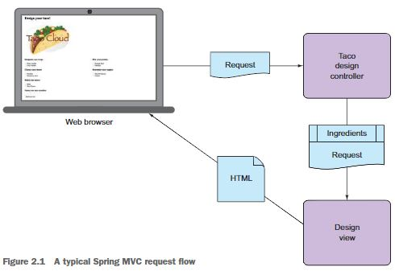

# CHAPTER 2 웹 애플리케이션 개발하기 34

## 2.1 정보 보여주기 35

STS를 실행하고 작업 영역workspace를 taco-cloud의 부모 디렉토리로 지정하면 된다.

스프링 MVC의 요청 처리 흐름은 다음과 같다.



### 2.1.1 도메인 설정하기 36

도메인은 해당 애플리케이션의 이해에 필요한 개념을 다루는 영역이다.

해당 항목을 pom.xml에 추가한다.

```xml
<!-- 다음 항목을 우리가 직접 추가할 수도 있다. -->
<dependency>
    <groupId>org.projectlombok</groupId>
    <artifactId>lombok</artifactId>
    <optional>true</optional>
</dependency>
```

```java
// lombok이라는 좋은 라이브러리를 사용해서 그런 메서드들을 런타임 시에 자동으로 생성하기 때문이다.
@Data
@RequiredArgsConstructor
public class Ingredient {

	private final String id;
	private final String name;
	private final Type type;

	public static enum Type {
		WRAP, PROTEIN, VEGGIES, CHEESE, SAUCE
	}
}
```

### 2.1.2 컨트롤러 클래스 생성하기 41

```java
/*
 * 다음 애너태이션은 SLF4j Logger를 생성한다.
 * private static final org.slf4jLogger log =
 * org.slf4j.LoggerFactory.getLogger(DesignTacoController.class);
 */
@Slf4j
// 해당 클래스를 컨트롤러로 식별되게 한다.
@Controller
// 해당 컨트롤러가 /design의 요청을 처리한다.
@RequestMapping("/design")
```

| 애노테이션      | 설명                         |
| --------------- | ---------------------------- |
| @RequestMapping | 다목적 요청을 처리한다.      |
| @GetMapping     | GET 요청을 처리한다.         |
| @PostMapping    | HTTP POST 요청을 처리한다.   |
| @PutMapping     | HTTP PUT 요청을 처리한다.    |
| @DeleteMapping  | HTTP DELETE 요청을 처리한다. |
| @PatchMapping   | HTTP PATCH 요청을 처리한다.  |

### 2.1.3 뷰 디자인하기 45

```xml
<!-- Thymeleaf 스타터 생성 -->
<dependency>
    <groupId>org.springframework.boot</groupId>
    <artifactId>spring-boot-starter-thymeleaf</artifactId>
</dependency>
```

## 2.2 폼 제출 처리하기 51

```java
/**
 *
 * @param design @Valid annotation이 붙었으므로
 * @param errors
 * @return
 */
@PostMapping
public String processDesign(@Valid Taco design, Errors errors) {
    if (errors.hasErrors()) {
        return "design";
    }

    // 이 지점에서 타코 디자인(선택된 식자재 내역)을 저장한다…
    // 이 작업은 3장에서 할 것이다.
    log.info("Processing design: " + design);
    return "redirect:/orders/current";
}
```

```java
@Slf4j
@Controller
@RequestMapping("/orders")
public class OrderController {

	@GetMapping("/current")
	public String orderForm(Model model) {
		model.addAttribute("order", new Order());
		return "orderForm";
	}
}

```

```html
<form method="POST" th:action="@{/orders}" th:object="${order}">
  <input type="submit" value="Submit order" />
</form>
```

```java
@PostMapping
public String processOrder(@Valid Order order, Errors errors) {
    //에러가 있으면 처리를 중단하고 design 뷰 이름을 반환하여 폼이 다시 보이게 한다.
    if (errors.hasErrors()) {
        return "orderForm";
    }

    log.info("Order submitted: " + order);
    return "redirect:/";
}
```

## 2.3 폼 입력 유효성 검사하기 57

### 2.3.1 유효성 검사 규칙 선언하기 58

```java
@Data
public class Taco {

//	null이 아니어야 한다는 규칙과 더불어 최소 5글자여야 한다.
	@NotNull
	@Size(min=5, message="Name must be at least 5 characters long")
	private String name;

	@Size(min=1, message="You must choose at least 1 ingredient")
	private List<String> ingredients;
}
```

```java
@Data
public class Order {

	@NotBlank(message="Name is required")
	private String deliveryName;

//	Luhn알고리즘 검사에 합격한 유효한 신용 카드 번호이어야 한다는 것을 선언한다.
//	그러나 이 신용카드 번호는 실재하는지까지는 알지 못한다.
	@CreditCardNumber(message="Not a valid credit card number")
	private String ccNumber;

	@Pattern(regexp="^(0[1-9]|1[0-2])([\\/])([1-9][0-9])$",
			message="Must be formatted MM/YY")
	private String ccExpiration;

	@Digits(integer=3, fraction=0, message="Invalid CVV")
	private String ccCVV;
}
```

### 2.3.2 폼과 바인딩될 때 유효성 검사 수행하기 60

```java
/**
 *
 * @param design @Valid annotation이 붙었으므로
 * @param errors
 * @return
 */
@PostMapping
public String processDesign(@Valid Taco design, Errors errors) {
    if (errors.hasErrors()) {
        return "design";
    }

    // 이 지점에서 타코 디자인(선택된 식자재 내역)을 저장한다…
    // 이 작업은 3장에서 할 것이다.
    log.info("Processing design: " + design);
    return "redirect:/orders/current";
}
```

```java
@PostMapping
public String processOrder(@Valid Order order, Errors errors) {
    //에러가 있으면 처리를 중단하고 design 뷰 이름을 반환하여 폼이 다시 보이게 한다.
    if (errors.hasErrors()) {
        return "orderForm";
    }

    log.info("Order submitted: " + order);
    return "redirect:/";
}
```

### 2.3.3 유효성 검사 에러 보여주기 62

```html
<label for="ccCVV">CVV: </label>
<input type="text" th:field="*{ccCVV}" />
<span
  class="validationError"
  th:if="${#fields.hasErrors('ccCVV')}"
  th:errors="*{ccCVV}"
  >CC Num Error</span
>
<br />
```

## 2.4 뷰 컨트롤러로 작업하기 65

- 이처럼 뷰에 요청을 전달하는 일만 하는 컨트롤러를 선언하는 방법을 알아보자.

- 이렇게 하고 나서 `homeController`를 삭제한다.
- `HomeControllerTest` 를 열고 `@WebMvcTest(HomeController.class)`를 `@WebMvcTest`로 변경하게 된다.

```java
@Configuration
public class WebConfig implements WebMvcConfigurer {

	@Override
	public void addViewControllers(ViewControllerRegistry registry) {
		registry.addViewController("/").setViewName("home");
	}
}
```

- 똑같은 뷰 컨트롤러 선언을 부트스트랩 클래스인 TacoCloudApplication에 추가할 수 있다.

```java
@SpringBootApplication
public class TacoCloudApplication implements WebMvcConfigurer {

    public static void main(String[] args) {
        SpringApplication.run(TacoCloudApplication.class, args);
    }

    @Override
    public void addViewControllers(ViewControllerRegistry registry) {
        registry.addViewController("/").setViewName("home");

    }

}

```

## 2.5 뷰 템플릿 라이브러리 선택하기 68

```xml
<!-- Thymeleaf 스타터 생성 -->
<dependency>
    <groupId>org.springframework.boot</groupId>
    <artifactId>spring-boot-starter-thymeleaf</artifactId>
</dependency>
```

- mustache로 변경하는 경우 다음과 같이 변경하면 된다.

```xml
<!-- Thymeleaf 스타터 생성 -->
<dependency>
    <groupId>org.springframework.boot</groupId>
    <artifactId>spring-boot-starter-mustache</artifactId>
</dependency>
```

### 2.5.1 템플릿 캐싱 70

기본적으로 템플릿은 최초 사용될 때 한번만 파싱된다. 그러나 개발 시에는 템플릿 캐싱이 그리 달갑지 않다. 다행스럽게도 템플릿 캐싱을 비활성화하는 방법이 있다. `application.properties` 파일에 다음을 추가한다. 단 운영환경에서 애플리케이션을 배포할 경우에는 방금 추가한 설정을 삭제하거나 true로 변경해야 하는 점에 유의한다.

```properties
spring.thymeleaf.cache=false
```

## 요약 71

- 스프링 MVC는 애노테이션을 기반하여, `@RequestMapping`, `@GetMapping`, `@PostMapping` 등등의 애노테이션에 사용해서 요청 처리 메서드를 선언하게 된다.
